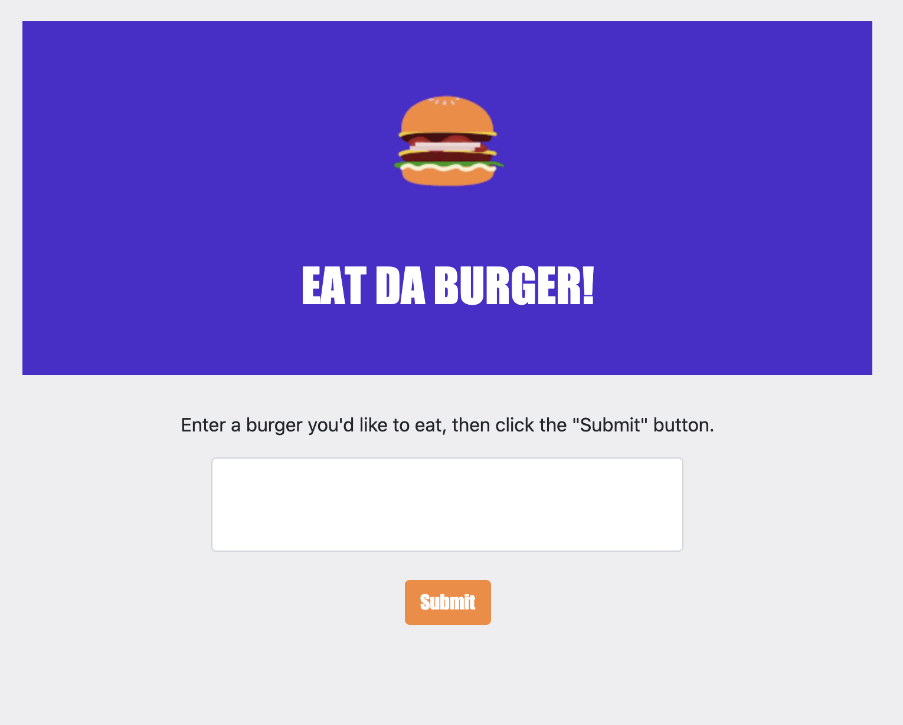
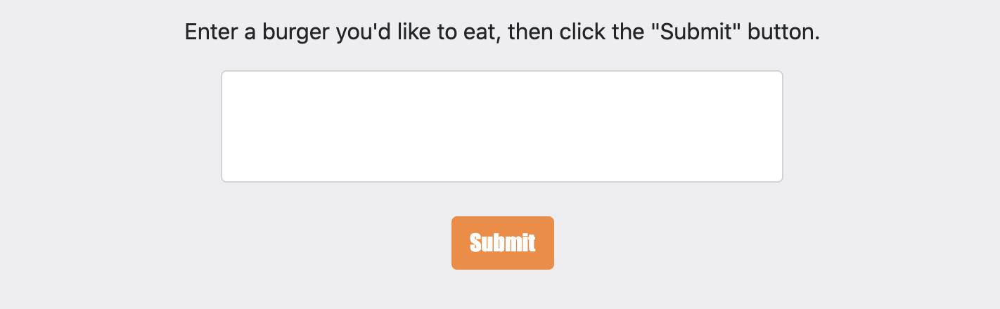

# Get In My Burger

  ## Table of Contents

  - [Description](#description)
  - [Installation](#installInstructions)
  - [Usage](#usageInfo)
  - [Contributions & Guidelines](#contributorGuidelines)
  - [Tests](#testInstructions)
  - [Questions](#questions)

  ## Description 

This Burger App will allow a user to enter a burger of their choice and have their selection displayed along side a `Devour It` button. The user can then click the `Devour It` button to remove their burger selection from the application. The application will store as many burgers the user wishes to create. 

### Employee Tracker View All

### Employee Tracker Add Role

  ## Installation 

   To install this express application clone code to a local repository.

  ## Usage 

   To use this MySQL and Express application the user can must use a VSCode and use installed dependencies to launch the application. The user will also need to run the schema.sql file in MySQL to launch the database. To make this application's data their own, the user can delete existing employees through the application or attached schema.sql file. The user can also use this application in the deployed heroku link: https://fathomless-harbor-25447.herokuapp.com/

  ## Contributions & Guidelines 

   This application was created by developer: Christina Flores. 

  ## Tests 

N/A 

  ## Questions 

  [To reach me by email click here.](mailto:.com) 

  [Click for my Github profile.](https://github.com/) 

  ## Badges 

  
   

